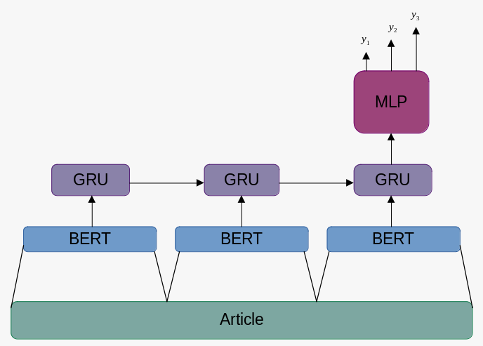

# CSC413H5 Final Project

## Introduction

Our deep learning model will perform hierarchical, multi-label classification to articles. Note that this is different from multi-class classification which assigns a *single* label/class to an input which is chosen from a group of multiple labels/classes. In particular, given an article as input, our model will assign 3 class labels to it, each of which come from a set of labels: L1, L2 and L3 respectively.  Li contains broader labels than Lj where i < j.  To illustrate, our model may assign labels: {Place, Building, HistoricalBuilding} to an article where Place ∈ L1,  Building ∈ L2 and HistoricalBuilding ∈ L3.  Note that Building is a type of Place while HistoricalBuilding is a type of Building.  Tagging an unstructured article with these 3 labels serves to categorize and add some structure to it.

## Model

We tackle the issue of hierarchical classification using an encoder-decoder
architecture composed of a transformer-based encoder and RNN-based decoder.
An illustration of the model can be seen below.

### Encoder

Our model used a pre-trained BERT transformer to encode input text into a
single dense tensor. The chosen implementation is the `bert-base-uncased` by
Hugging Face, which was pretrained on the BookCorpus and English Wikipedia
datasets. The whole model contains 109,482,240 pre-trained parameters, none of
which are further tuned as part of our application.

### Decoder

Our decoder model takes in a text embeddings and generates three separate
predictions, each corresponding to one level of class specificity. Each level
has its own MLP to used to project the last level's output onto the input
dimension of an RNN; we call these embedding MLPs. Much like other sequence
generation tasks, the first level takes in the encoder output (the text embedding).
Each level also has its own MLP used to project the RNN output onto a class
prediction for that specific level; these are called classifier MLPs. In
between these MLPs, we utilize a common RNN body composed of Gated Recurrent
Units to enable weight sharing and information passing from one level to the next.
We chose an RNN instead of a Transformer body for our decoder as the former
proved to be more flexible for generating sequences with different input and output
dimensions. Additionally, we would like for encourage a certain degree of
information decay over the network to embody how each level should mosty use
information of the previous level.

The parameter distribution of each decoder component is a follows:

## Data

### Summary Statistics and Split

The dataset we are using is the [Kaggle DBPedia Classes dataset](https://www.kaggle.com/datasets/danofer/dbpedia-classes). There are 337739 data points in the dataset. 240942 (71%) of these points are in the training set, 36003 (11%) are in the validation set and 60794 (18%) are in the test set. This is the default split that came with the Kaggle dataset. The ratio between training+validation points and test points is roughly 80:20 which seems like a common ratio chosen by many machine learning practicioners. However, the optimal data split also depends on the volume of data avaliable and an 80:20 split may not be an optimal split for all datasets. In addition, the data points chosen for the training data should give a good representation of the entire dataset while leaving enough test points to determine whether the model generalizes well. We believe the collectors of the data in the Kaggle DBPedia dataset conducted careful experiments to determine the optimal dataset split. 
<!-- 
#which should ideally reduce performance variance in the training set  -->

Each data point in the data set is a 4-tuple with shape (4,).  It can be represented as: (article, L1, L2, L3) where article is the input Wikipedia article and L1, L2 and L3 are the 3 ground truth labels as outlined in the Introduction. Each of the values in the tuple are represented as strings. There are 9, 70 and 219 labels in L1, L2 and L3 respectively. The 3 most common L1, L2 and L3 labels along with their frequency percentages in the training set are:  L1:  (’Agent’,  51.80%),  (’Place’, 19.04%), (’Species’, 8.91%), L2:  (’Athlete’, 12.91%), (’Person’, 8.09%), (’Animal’, 6.09%) and L3:  (’AcademicJournal’, 0.80%), (’Manga’, 0.80%), (’FigureSkater’, 0.80%).  Note that slightly over half of the articles in the training set have an L1 classification of ’Agent’.  In the L3 classifications, there is no dominant label since the 3 most common labels all appear in 0.80% of the articles.  The minimum, maximum and average article length in the training set are:  11, 499 and 102.80 tokens respectively.

<!-- We used the [DBPedia Classes Kaggle dataset](https://www.kaggle.com/datasets/danofer/dbpedia-classes) for training
and evaluating our model. It contains 342780 data points, consisting of a Wikipedia article's summary, and it's
classification in 3 levels of categories, ranging from broad categories such as 'Agent' or 'Place', to specific
categories such as 'Earthquake' or 'SolarEclipse'. -->

### Data Transformation

<!-- (article, L1, L2, L3) -->

Recall that in our model, articles get fed as input to a pre-trained BERT transformer which encodes the article to a fixed-length vector embedding of shape: 1x768. However, as outlined in the Model section, BERT expects the input sequence to be in a special format. To aid with this, we pass our articles to BERTTokenizer which does the work of tokenizing the articles. In particular, this involves converting words to tokens, adding a [CLS] token to the beginning of each article and a [SEP] token to the end of each article. Note that we treat each article as a sequence. We could have been more granular and treated each sentence within the article as a sequence. This would involve adding a [CLS] token to denote the start of the sentence and a [SEP] token to separate sentences. However, from the BERT paper [1]: "A “sentence” can be an arbitrary span of contiguous text, rather than an actual linguistic sentence". Thus, we are treating each article as a "sentence". [Mention about attention masks]

Next, the maximum token length that BERT supports is 512. To accomodate this, we remove punctuation from each article and use the first 510 words from each article. This allows all *tokenized* articles to meet the 512 maximum length requirement for the BERT transformer. *tokenized* is italizicized since although an article may be 510 words, it's tokenized representation may be a different length. Other strategies for article truncation were considered such as keeping all punctuation but using a smaller region of the article as input. However, after some experimentation, the strategy we used gives the best performance on the validation set. 

Lastly, recall that a data point looks something like: (article, L1, L2, L3) where article is the model input and (L1,L2,L3) are the ground truth labels. Each parameter is a string. Articles are converted to tokens which are then mapped to integers. This is handled by the BERT Tokenizer. However, we must manually map the ground truth labels to integers since this is not handled by BERT. This is what the WordIdMapping class is for. It contains an array of 3 dictionaries: word_to_id where word_to_id[i] is a dictionary mapping an Li label to a unique integer. id_to_word is an array of 3 arrays where id_to_word[i] is an array containing the Li labels as strings. This is used for giving each label a unique integer id. As we iterate through the training set to encode each article, we extract the article label strings and call *map_data.add_and_get(labs)* which converts them to integer ids. This label representation will serve useful when performing multi-label classification. Namely, given a single article embedding, the output of the model forward pass is an array of 3 prediction arrays: *preds*. preds[i] is a vector shape: Li where Li is the number of labels in Li. For instance, preds[0] has shape 9 representing the un-normalized scores for each of the 9 L1 labels. Thus, it is useful to assign each L1 label a unique integer id between 0-8 which is what word_to_id is for! Similarly, we assign integer ids to L2 and L3 labels which have unique ids between 0-69 and 0-218 respectively.

<!-- After the data is processed, we return two arrays:  -->

<!-- There is also the option to pad each article so they are the same length but we decided to omit this. -->
 

## Training

*To be filled in*

## Results

*To be filled in*

## References

[1] https://arxiv.org/pdf/1810.04805.pdf

#### Authored by: Keith Allatt, Brandon Jaipersaud, David Chen, Renato Zimmermann

