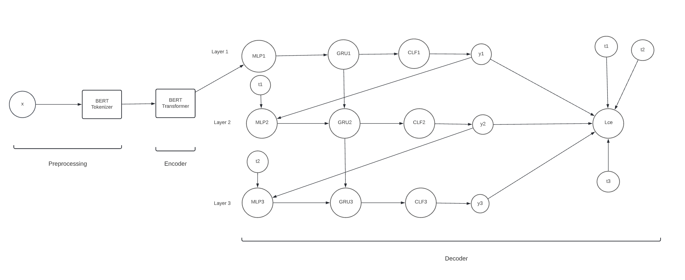
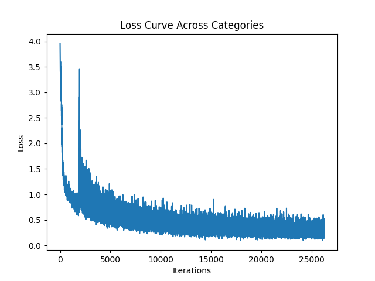
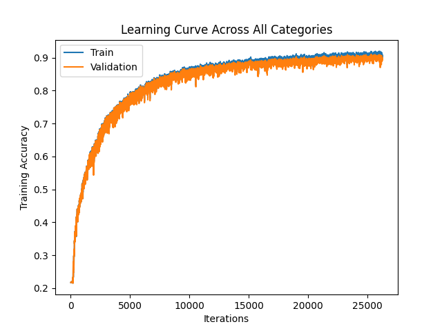

# Hierarchical, Multi-Label Classification on DBPedia

## Introduction


Our deep learning model will perform hierarchical, multi-label classification to articles. From now on we will abbreviate this to (HMLC). Note that this is different from multi-class classification which assigns a *single* label/class to an input which is chosen from a group of multiple labels/classes. In particular, given an article as input, our model will assign 3 class labels to it, each of which come from a set of labels: L1, L2 and L3 respectively.  Li contains broader labels than Lj where i < j.  To illustrate, our model may assign labels: {Place, Building, HistoricalBuilding} to an article where Place ∈ L1,  Building ∈ L2 and HistoricalBuilding ∈ L3.  Note that Building is a type of Place while HistoricalBuilding is a type of Building.  Tagging an unstructured article with these 3 labels serves to categorize and add some structure to it.


## Model

### Overview

We tackle the HMLC task using an encoder-decoder 
architecture composed of a transformer-based encoder and a stacked MLP+GRU decoder with 3 layers. Layers 1, 2 and 3 are responsible for making L1, L2 and L3 classifications respectively. `process_documents()` in `data_cleaning.py` 
defines the implementation of our encoder. The `HierarchicalRNN` class in `model.py` defines the implementation of our decoder.


### Design Decisions


#### Using BERT as our Encoder

Our choice of encoder is a pre-trained BERT transformer as outlined in [1]. Our chosen implementation is the `bert-base-uncased` by
Hugging Face, which was pretrained on the BookCorpus and English Wikipedia datasets. BERT is a state-of-the-art encoder used for NLP-based tasks. One of its distinguishing features is its bidirectional language modelling. Most other transformers and language models are unidirectional. For instance, recall the 4-gram language model developed in CSC413 A1. This model was trained to predict the next word given the previous three words in a sentence which makes it a unidirectional language model. In contrast, BERT uses both left and right context when encoding sequences which will make it much better at summarizing and learning the "gist" of an article.


The input to our model are articles which are very long sequences. Using a traditional RNN would be a poor choice of encoder since it would fail to effectively summarize and extract the important parts of the article. The attention mechanism of a transformer was designed to solve this issue. Furthermore, the articles in our training set are Wikipedia articles. Since `bert-base-uncased` was also trained on Wikipedia articles, it makes this model an even better candidate to use as an encoder. 


### Model Diagram and Forward Pass

The computation graph of our model is shown below:




#### Encoder

Our encoder model takes in a single article, x as input. The article must go through a pre-processing stage which does two things: First, punctuation is stripped from the article and the first 510 article characters are taken. Second, the truncated article is passed to a BERT Tokenizer which converts the article to a format acceptable by the BERT transformer. These ideas are outlined in more detail in the Data Transformation section of the report. The tokenized article is then passed to the BERT Transformer which outputs an article embedding of shape 1x768. Intuitively, this represents a summarized version of the article.


#### Decoder

The decoder portion of our model takes in the encoded article of shape 1x768. It consists of three layers: One for predicting L1, L2 and L3 labels respectively. Each Layer i begins with an MLP which we call the *embedding MLP*. MLP1 takes the encoded article as input. MLP2 and MLP3 take in *either* the prediction of the previous layer with probability p or the true labels of the previous layer (i.e. t1 or t2) with probability 1-p. These are represented as one-hot vectors. To illustrate, in the computation graph above, MLP2 takes in y1 with probability p and t1 with probability 1-p. t1 is a 1x9, 1-hot vector that represents the true L1 label assigned to the article. y1 is a 1x9 vector of un-normalized L1 class scores. We first apply argmax(y1) to determine what L1 class the model predicts and then convert it to a 1-hot vector. This gets passed to MLP2 with probability p. This implements *teacher forcing* since we feed the ground truth labels of Layer i to Layer i+1. Each embedding MLP contains several layers with a ReLU activation function applied between each layer. It outputs a vector of shape 1x100 which then gets fed into a GRU. The number of features in the hidden state of the GRU is a hyperparameter which is set to 100 by default. The GRU aims to remember sequential information between the layers. This is important since the L1, L2 and L3 labels have dependencies between them. For instance, Place ∈ L1, Building ∈ L2 and HistoricalBuilding ∈ L3. The L3 labels are a specific type of L2 label which are in turn a specific type of L1 label. Thus, for example, when predicting an L2 label, we would like to remember the information in our prediction of the L1 label to aid in our L2 prediction. To accomplish this, the inputs to GRUi is the output of GRUi-1 and the output of MLPi with the exception of GRU1 which takes in just the output of MLP1 since it is the first layer. The output of each GRU is a 1x100 vector which gets fed into a *classifer MLP*: CLFi. Similar to the embedding MLP, the classifier MLP contains several layers with ReLU applied between each layer. However, it outputs a vector of unnormalized class scores: yi for Layer i and gets fed into the embedding MLP in the next layer. Thus, y1, y2 and y3 have shapes: 1x9, 1x70 and 1x219 respectively which are the number of labels in L1, L2 and L3. Lastly, we compute the cross entropy loss: Lce by averaging the L1,L2 and L3 cross entropies.


<!-- ### Decoder

Our decoder model takes in a text embeddings and generates three separate
predictions, each corresponding to one level of class specificity. Each level
has its own MLP to used to project the last level's output onto the input
dimension of an RNN; we call these embedding MLPs. Much like other sequence
generation tasks, the first level takes in the encoder output (the text embedding).
Each level also has its own MLP used to project the RNN output onto a class
prediction for that specific level; these are called classifier MLPs. In
between these MLPs, we utilize a common RNN body composed of Gated Recurrent
Units to enable weight sharing and information passing from one level to the next.
We chose an RNN instead of a Transformer body for our decoder as the former
proved to be more flexible for generating sequences with different input and output
dimensions. Additionally, we would like for encourage a certain degree of
information decay over the network to embody how each level should mosty use
information of the previous level. -->

<!-- The parameter distribution of each decoder component is a follows: -->


<!-- ### Encoder

Our model used a pre-trained BERT transformer to encode input text into a
single dense tensor. The chosen implementation is the `bert-base-uncased` by
Hugging Face, which was pretrained on the BookCorpus and English Wikipedia
datasets. The whole model contains 109,482,240 pre-trained parameters, none of
which are further tuned as part of our application. -->


### Model Parameters


### Encoder

The pre-trained `bert-base-uncased` model which we use as our encoder, contains 110 million parameters [2]. However, these parameters have already been set by the pre-trained model so we don't include them as part of our tuneable parameter count.


### Decoder 

#### Understanding the Shapes of the Decoder Components


To count the number of parameters in the decoder portion of our model we must consider the embedding and classifier
MLPs at each layer as well as the GRUs. The number of layers in each MLP and the output shape of the embedding MLPs is a hyperparameter. In our model, this is
configured by specifying three parameters: embedding_size and [emb|clf]_size_mults. The former specifies the output shape of the embedding MLP. The latter is an n-tuple which defines the number of layers in the embedding/classifier MLPs and the number of hidden units in the current MLP layer as a multiple of the hidden units in the previous MLP layer. Note that the output shape of the classifier MLPs are fixed since they represent the un-normalized class scores for the L1,L2,L3 labels respectively. To illustrate, suppose embedding_size=100 and emb_size_mults = (1,2,3). The input/output shapes of MLP1 from the diagram looks like: (in_features=768, out_features=768) -> (in_features=768, out_features=1536) -> (in_features=1536, out_features=4608) -> (in_features=4608, out_features=100). The input/output shapes of MLP2 looks like:  (in_features=9, out_features=9) -> (in_features=9, out_features=18) -> (in_features=18, out_features=54) -> (in_features=54, out_features=100). Notice that the input to MLP1 is a 1x768 vector which represents the encoded article. The input to MLP2 is a 1x9 vector which represents the output of Layer 1. Also notice that the output features/number of hidden units in each layer is determined by the emb_multiplier: (1,2,3). Both MLPs output a 1x100 vector as determined by embedding_size=100. This is useful since the inputs to the GRU at each layer must be the same shape. 

The input/output of the classifier MLPs are determined in a similar fashion. clf_multiplier is used instead of emb_multiplier to define the number of layers and hidden units in the classifier MLPs. The outputs of CLF1, CLF2 and CLF3 are 1x9, 1x70 and 1x219 respectively which represent the un-normalized class scores for L1, L2 and L3 respectively. 

Lastly, the number of features of the GRUs in each layer is a hyperparameter which is calculated as a multiple of the emb_size. For instance, if emb_size = 100 and rnn_size_mult = 1, each GRU will contain 100 features. The number of GRU layers can also be configured via. rnn_n_hidden but we leave this as 1 when tuning our hyperparameters. 

#### Number of Parameters in the Decoder


Our final model uses the default parameters specified in the `HierarchicalRNN` class in `model.py`. The only exception is the learning rate which was set to the value discovered in the Hyperparameter Tuning section. A summary of the number of trainable decoder parameters is below:

<table>
  <tr>
    <th>Component</th>
    <th>Trainable Parameters</th>
  
  </tr>
  <tr>
    <td>MLP1</td>
    <td>768*768 + 768*100 + 768+100 = 667492 </td>
  
  </tr>
  <tr>
    <td>MLP2</td>
    <td>9*9 + 9*100 + 9+100 = 1090 </td>
  </tr>
  <tr>
    <td>MLP3</td>
    <td>70*70 + 70*100 + 70+100 = 12070 </td>
  
  </tr>
  <tr>
    <td>CLF1</td>
    <td>100*100 + 100*9 + 100+9 = 11009 </td>
   
  </tr>
  <tr>
    <td>CLF2</td>
    <td>100*100 + 100*70 + 100+70 = 17170</td>
    
  </tr>
  <tr>
    <td>CLF3</td>
    <td>100*100 + 100*219 + 100+219 = 32219</td>
  </tr>
  <tr>
    <td>GRU</td>
    <td>60600</td>
  </tr>
  <tr>
    <td>Total</td>
    <td>801650</td>
  </tr>
</table>


The MLPs contain two layers including the final output layer. Note that both MLPi and CLFi are MLPs as was discussed earlier. The first two terms in the MLP/CLF trainable parameters represent the number of weights in layer 1 and 2 respectively. The last two terms add the biases for each layer. These numbers can be verified by using the `get_param_sizes(model)` function in `utilities.py` which iterates through each component and tracks the number of parameters using the PyTorch method `model.parameters()`.

From the above table, we see that the total number of trainable parameters used by our final model is 801,650.


### Successful/Unsuccessful Model Classification

Below are a series of Wikipedia article summaries found in the DBPedia testing set. As our model classifies each
article summary at 3 levels, examples of successful and unsuccessful classifications are provided for each level,
as well as an example of a successful and unsuccessful classification at all 3 levels simultaneously.

---
Here is a summary that our model incorrectly classifies at all levels.


```
"The Wildman River is a river in the Darwin Coastal bioregion of the Northern Territory, Australia."
```

At the L1 level, the correct label is `Place`, but our model predicted `Species`.

At the L2 level, the correct label is `Stream`, but our model predicted `Animal`.

At the L3 level, the correct label is `River`, but our model predicted `Fish`.

---

Here is a summary that our model correctly classifies at all levels.


```
Hirfanlı Dam is a dam in Turkey. The development was backed by the Turkish State Hydraulic Works. It was built by Wimpey Construction and was completed in 1959.
```

At the L1 level, the correct label is `Place`, and our model correctly predicted this.

At the L2 level, the correct label is `Infrastructure`, and our model correctly predicted this.

At the L3 level, the correct label is `Dam`, and our model correctly predicted this.

---

Here is a summary that our model incorrectly classifies at the L1 level.


```
"The inaugural Singapore League Cup was held in 2007. The tournament was held before the start of the S.League season that year. Prior to this tournament, there is another tournament with the same name that was held until in 1997 where the Singapore Armed Forces had defeated Geylang United by 1-0 in the final. However that old Singapore League Cup was subsequently renamed into present Singapore Cup and evolved to be the major cup competition in Singapore football. In recent years, invitational foreign teams participated in the Singapore Cup along with the local clubs. The League Cup, however, is solely reserved for domestic clubs. The 2007 competition was sponsored by SingTel, and officially titled the SingTel League Cup. A direct knockout format was used, with the first round being the quarter-final stage as only eight out of the twelve S.League teams participated in the competition. The 4 teams who withdrew due to prior pre-season commitments were: \n*  23x Geylang United \n*  23x Liaoning Guangyuan FC \n*  23x SAFFC \n*  23x Young Lions The winners received a prize of S$20,000 with the runners-up and second runners-up taking home S$10,000 and S$5,000 respectively. Woodlands Wellington defeated Sengkang Punggol 4-0 in the final to win the first Singapore League Cup. Gombak United defeated Home United in the third-place match 9-8 on penalties following a 1-1 draw."
```

At the L1 level, the correct label is `Event`, but our model predicted `Agent`.

---

Here is a summary that our model correctly classifies at the L1 level.


```
"Liu Chao-shiuan (Chinese: 劉兆玄; pinyin: Liú Zhàoxuán; born May 10, 1943) is a Taiwanese educator and politician. He is a former president of the National Tsing Hua University (1987–1993) and Soochow University (2004–2008) and a former Premier of the Republic of China (2008–2009)."
```

At the L1 level, the correct label is `Agent`, and our model correctly predicted this.

---

Here is a summary that our model incorrectly classifies at the L2 level.


```
"Michelle Maylene (born January 20, 1987) is an actress, adult model, and former adult film star."
```

At the L2 level, the correct label is `Actor`, but our model predicted `Person`.

---

Here is a summary that our model correctly classifies at the L2 level.


```
"Grote Prijs Stad Zottegem is a single-day road bicycle race held annually in August in Zottegem, Belgium. Since 2005, the race is organized as a 1.1 event on the UCI Europe Tour. The race started out as 'Dokter Tistaertprijs' in 1934. Between 1971 and 1998 it was called 'Herinneringsprijs Dokter Tistaert - Prijs Groot-Zottegem'. In 1999 it changed to 'G.P. Zottegem - Tistaertprijs' and since 2002 it has the current name."
```

At the L2 level, the correct label is `Race`, and our model correctly predicted this.

---

Here is a summary that our model incorrectly classifies at the L3 level.


```
"Johannes Petrus \""Hans\"" Nijman (September 23, 1959 – November 5, 2014) was a Dutch former professional mixed martial artist and professional wrestler. He competed in the heavyweight division. He was a RINGS Holland veteran and fought for many other top promotions such as Pride FC and It's Showtime. Nijman is believed to have had connections with Willem Holleeder and other big names in the Dutch criminal underworld. His name appeared in several police records and has also been used in big court cases."
```

At the L3 level, the correct label is `MartialArtist`, but our model predicted `AmateurBoxer`.

---

Here is a summary that our model correctly classifies at the L3 level.


```
"Brekke Church (Norwegian: Brekke kyrkje) is a parish church in Gulen Municipality in Sogn og Fjordane county, Norway. It is located in the village of Brekke. The church is part of the Brekke parish in the Nordhordland deanery in the Diocese of Bjørgvin. The white, wooden church, which has 390 seats, was consecrated on 19 November 1862 by the local Dean Thomas Erichsen. The architect Christian Henrik Grosch made the designs for the church, which is the third church on the site."
```

At the L3 level, the correct label is `HistoricBuilding`, and our model correctly predicted this.


## Data

### Summary Statistics and Split

The dataset we are using is the [Kaggle DBPedia Classes dataset](https://www.kaggle.com/datasets/danofer/dbpedia-classes). There are 337739 data points in the dataset. 240942 (71%) of these points are in the training set, 36003 (11%) are in the validation set and 60794 (18%) are in the test set. This is the default split that came with the Kaggle dataset. The ratio between training+validation points and test points is roughly 80:20 which seems like a common ratio chosen by many machine learning practicioners. However, the optimal data split also depends on the volume of data avaliable and an 80:20 split may not be an optimal split for all datasets. In addition, the data points chosen for the training data should give a good representation of the entire dataset while leaving enough test points to determine whether the model generalizes well. We believe the collectors of the data in the Kaggle DBPedia dataset conducted careful experiments to determine the optimal dataset split. 
<!-- 
#which should ideally reduce performance variance in the training set  -->

Each data point in the data set is a 4-tuple with shape (4,).  It can be represented as: (article, L1, L2, L3) where article is the input Wikipedia article and L1, L2 and L3 are the 3 ground truth labels as outlined in the Introduction. Each of the values in the tuple are represented as strings. There are 9, 70 and 219 labels in L1, L2 and L3 respectively. The 3 most common L1, L2 and L3 labels along with their frequency percentages in the training set are:  L1:  (’Agent’,  51.80%),  (’Place’, 19.04%), (’Species’, 8.91%), L2:  (’Athlete’, 12.91%), (’Person’, 8.09%), (’Animal’, 6.09%) and L3:  (’AcademicJournal’, 0.80%), (’Manga’, 0.80%), (’FigureSkater’, 0.80%).  Note that slightly over half of the articles in the training set have an L1 classification of ’Agent’.  In the L3 classifications, there is no dominant label since the 3 most common labels all appear in 0.80% of the articles.  The minimum, maximum and average article length in the training set are:  11, 499 and 102.80 tokens respectively.

<!-- We used the [DBPedia Classes Kaggle dataset](https://www.kaggle.com/datasets/danofer/dbpedia-classes) for training
and evaluating our model. It contains 342780 data points, consisting of a Wikipedia article's summary, and it's
classification in 3 levels of categories, ranging from broad categories such as 'Agent' or 'Place', to specific
categories such as 'Earthquake' or 'SolarEclipse'. -->

### Data Transformation


Recall that in our model, articles get fed as input to a pre-trained BERT transformer which encodes the article to a fixed-length vector embedding of shape: 1x768. However, as outlined in the Model section, BERT expects the input sequence to be in a special format. To aid with this, we pass our articles to BERTTokenizer which does the work of tokenizing the articles. In particular, this involves converting words to tokens, adding a [CLS] token to the beginning of each article and a [SEP] token to the end of each article. Note that we treat each article as a sequence. We could have been more granular and treated each sentence within the article as a sequence. This would involve adding a [CLS] token to denote the start of the sentence and a [SEP] token to separate sentences. However, from the BERT paper [1]: "A “sentence” can be an arbitrary span of contiguous text, rather than an actual linguistic sentence". Thus, we are treating each article as a "sentence". 

Next, the maximum token length that BERT supports is 512. To accomodate this, we remove punctuation from each article and use the first 510 characters from each article. This allows all *tokenized* articles to meet the 512 maximum length requirement for the BERT transformer. *tokenized* is italizicized since although an article may be 510 characters, its tokenized representation may be a different length. Other strategies for article truncation were considered such as keeping all punctuation but using a smaller region of the article as input. However, after some experimentation, the strategy we used gives the best performance on the validation set. 


Lastly, recall that a data point looks something like: (article, L1, L2, L3) where article is the model input and (L1,L2,L3) are the ground truth labels. Each parameter is a string. Articles are converted to tokens which are then mapped to integers. This is handled by the BERT Tokenizer. However, we must manually map the ground truth labels to integers since this is not handled by BERT. This is what the WordIdMapping class is for. It contains an array of 3 dictionaries: word_to_id where word_to_id[i] is a dictionary mapping an Li label to a unique integer. id_to_word is an array of 3 arrays where id_to_word[i] is an array containing the Li labels as strings. This is used for giving each label a unique integer id. As we iterate through the training set to encode each article, we extract the article label strings and call *map_data.add_and_get(labs)* which converts them to integer ids. This label representation will serve useful when performing HMLC. Namely, given a single article embedding, the output of the model forward pass is an array of 3 prediction arrays: *preds*. preds[i] is a vector with shape (Li,) where Li is the number of labels in Li. For instance, preds[0] has shape 9 representing the un-normalized scores for each of the 9 L1 labels. Thus, it is useful to assign each L1 label a unique integer id between 0-8 which is what word_to_id is for! Similarly, we assign integer ids to L2 and L3 labels which have unique ids between 0-69 and 0-218 respectively.


Note that no data augmentation was applied since we have an adequate volume of data in our dataset.

<!-- After the data is processed, we return two arrays:  
There is also the option to pad each article so they are the same length but we decided to omit this.  -->
 


## Training

### Learning and Loss Curves

Our final model uses the hyperparameters discussed in the Hyperparameter Tuning section. It was trained on 12,0000 points from the training set for 14 epochs. Below are the loss and accuracy curves computed across all 3 categories: L1, L2 and L3. To avoid cluttering the report, we have omitted including the per-category curves since they look nearly identical to the cross-category curves. However, we have included them all in final_model_stats/.  


<div class="row">
  <div class="column">
    
  </div>
  <div class="column">
    
  </div>
</div>


Final L1 Test Accuracy: 0.9822

Final L2 Test Accuracy: 0.9093

Final L3 Test Accuracy: 0.83

Final Total Test Accuracy: 0.9072

### Hyperparameter Tuning 
We first ran a grid-search over three candidate hyperparameters: learning rate, weight decay, and momentum, to find a reasonable baseline model and narrow the values that randomized search could take on. The values for the grid search try to cover the extremes of each variable domain. The tables below show the accuracy of each model on the validation set after 10 epochs of training, distinguished by learning rate with weight decay values on the left and momentum values on the right. Note that the definition of accuracy for our task of HMLC will be defined and discussed in the Quantitative Measures section below.

Learning rate = 0.001
| <br>  Weight Decay <br>  Momentum   | 0         | 0.01      | 0.1       |
|-----|-----------|-----------|-----------|
| 0   | 0.8167745 | 0.62938   | 0.218324  |
| 0.5 | 0.7811201 | 0.6425668 | 0.2183429 |
| 1   | 0.7973132 | 0.6279106 | 0.218315  |

Learning rate = 0.01
|  <br>  Weight Decay <br>  Momentum   | 0        | 0.01     | 0.1      |
|-----|----------|----------|----------|
| 0   | 0.218324 | 0.337444 | 0.218324 |
| 0.5 | 0.218324 | 0.345999 | 0.218315 |
| 1   | 0.218324 | 0.33046  | 0.218334 |

Learning rate = 0.1
|  <br>  Weight Decay <br>  Momentum    | 0        | 0.01     | 0.1      |
|-----|----------|----------|----------|
| 0   | 0.218343 | 0.218065 | 0.216889 |
| 0.5 | 0.218352 | 0.218297 | 0.218334 |
| 1   | 0.218343 | 0.218398 | 0.218223 |

From the results above, the model we use as a baseline has a learning rate of 0.001, with the other two parameters being 0. From there, we used randomized search to test models with slight variations in hyperparameter values to the baseline model. This is achieved by generating the values for each hyperparameter from a truncated Gaussian distribution. For example, the Gaussian for the learning rate is centered at 0.001 and truncated to only generate values in the interval (0.0005, 0.0015), so most of the time we will generate values around 0.001 and also never generate values too far from the baseline value. For the weight decay and momentum Gaussians, they were centered around 0.005 and truncated to be in the interval of (0, 0.01). Then, we generated a reasonable number of models to compare with the baseline to see if slight variations can improve validation accuracy. The model we are currently using has a learning rate of 0.001020977066089074, weight decay of 0, and momentum of 0.

Looking at the hyperparameters for the best model, it is interesting to see that momentum is at 0. The model with momentum and the model without momentum both achieve similar results during grid search. One explanation is that perhaps if the problem does have a simpler convex descent, then regardless of momentum, with the number of data points and epochs, the model can be optimized reasonably well so that it converges near the same minimum.

## Results

### Quantitative Measures


In this section we will discuss the evaluation metric we use to assess the performance of our model.

The task of HMLC is different from traditional multi-class classification. For the latter task, we would normally use accuracy as an evaluation metric. This is computed by simply dividing the number of correct classifications by the number of incorrect classifications. With HMLC we now have 3 labels to assign to an article, chosen from sets: L1, L2 and L3 respectively. We define the *total accuracy* as the accuracy across all 3 label sets. This is computed in the same way as with the multi-class classification task. We sum the number of correct classifications across all categories and divide by the number of misclassifications. In addition, we also compute individual L1, L2 and L3 accuracies so we can have a more granular picture of the per-category accuracies. Some other works like [3], [4] and [5] on HMLC use different evaluation metrics such as F1-score. However, we decided to keep our evaluation metric consistent with accuracy techniques used in the CSC413 course.


### Quantitative and Qualitative Results

### Testing the Reasonableness of our Model

#### Benchmarking

Various techniques were used to assess the reasonableness of our model. We did some benchmarking to compare the performance of our model to other models. Recall that our model uses an encoder-decoder architecture with a BERT transformer as the encoder and three stacked MLP+GRU+MLP layers as the decoder. The modularity of the encoder-decoder architecture allows for different encoder/decoder models to be experimented with. For instance, we were curious about the effect of the BERT encoder on the performance of our model. So we developed a new encoder called `EncoderRNN` in `model.py`. This encoder uses GloVe embeddings to represent each word in an article which then gets fed into a GRU with 768 features in each hidden state. The output is a 1x768 vector which represents the encoded article. Note that this is the same shape as the BERT encoder output in our original model.


We were also curious about the effect of having a GRU as part of our decoder. Intuitively, this is what connects the layers together and allows the L2 layer to make L2-classifications based on information from the L1 layer and similarly for the L3 layer making L3-classifications based on information gathered from the L2 layer (and indirectly, the L1 layer). For instance, recall that Place ∈ L1, Building ∈ L2 and HistoricalBuilding ∈ L3. The model should be able to use L1-based information (i.e. that the article describes a Place) when making an L2-classification (i.e. classifying the article as a Building which is a type of Place). We developed an alternate decoder called `BaselineMLP` in `model.py`. Recall the computation graph from earlier. This decoder only uses the 3 classifier MLPs: CLF1, CLF2 and CLF3. The encoded article is fed separately into each classifier and thus, the classifications in each layer are made independently. We hypothesize that this model should have lower performance than our original model since it will not learn the dependencies between the different layers. It is basically doing 3 independent multi-class classification tasks for L1, L2 and L3 respectively.

The below table summarizes the performance across all 3 models. Each model was trained on a subset of the training set consisting of 10000 data points under default parameters and varying number of epochs. The accuracy was computed over the entire test set.  


The `Original` model refers to our main model consisting of the BERT encoder + GRU/MLP decoder. The `EncoderRNN` was used with our standard GRU/MLP decoder. The `BaselineMLP` decoder was paired with our standard BERT encoder. We also include a row called `ChooseCommonClass` whose Li accuracy is computed by choosing the class that appears most frequently in each Li category. This is derived from the Summary Split and Statistics section where we determined what labels appear most frequently in each category. Recall, we saw that Agent is the most common L1 class with frequency roughly = 52% and Athlete is the most common L2 class with frequency roughly = 13%. In L3 there is no dominant class ; The top 3 most frequent classes appear 0.80% of the time. Our model should at the bare minimum perform better than choosing the most common class. For the total accuracy in the `ChooseCommonClass` row, we average the L1, L2 and L3 accuracies.


<table>
  <tr>
    <th>Model</th>
    <th>L1-Test-Accuracy</th>
    <th>L2-Test-Accuracy</th>
    <th>L3-Test-Accuracy</th>
    <th>Total-Test-Accuracy</th>
    <th>Epochs</th>
  </tr>
  <tr>
    <td>ChooseCommonClass</td>
    <td>0.52</td>
    <td>0.13</td>
    <td>0.008</td>
    <td>0.22</td>
    <td>N/A</td>
  </tr>
  <tr>
    <td>Original</td>
    <td>0.95</td>
    <td>0.78</td>
    <td>0.58</td>
    <td>0.77</td>
    <td>25</td>
  </tr>
   <tr>
    <td>BaselineMLP</td>
    <td>0.92</td>
    <td>0.79</td>
    <td>0.64</td>
    <td>0.78</td>
    <td>7</td>
  </tr>
   <tr>
    <td>EncoderRNN</td>
    <td>0.52</td>
    <td>0.13</td>
    <td>0.007</td>
    <td>0.22</td>
    <td>12</td>
  </tr>
 
</table>

These results will be interpreted and  analysed in the Justification of Results section.


#### Overfitting to a Small Dataset
To verify the correctness of our model, we created a few small custom datasets to test the models' ability to overfit on a small dataset. These can be generated by running `debug/gen_small_datasets.py`. It will construct 3 small datasets each of which contain 2 instances of each class in the L1, L2 and L3 categories. For instance, DBPEDIA_train_small_l1.csv contains 18 points in total, 2 of which come from a unique L1 class. Below is a summary of how long it took our model to reach near 100% accuracy on each dataset:


<table>
  <tr>
    <th>Dataset</th>
    <th>Training Accuracy</th>
    <th>Epochs</th>
  </tr>
  <tr>
    <td>DBPEDIA_train_small_l1.csv</td>
    <td>0.98</td>
    <td>90</td>
  </tr>
   <tr>
    <td> DBPEDIA_train_small_l2.csv</td>
    <td>0.98</td>
    <td>150</td>
  </tr>
   <tr>
    <td> DBPEDIA_train_small_l3.csv</td>
    <td>0.94</td>
    <td>150</td>
  </tr>
 
</table>

#### Future Experiments
To further test if our model correctly learns the dependencies between different layers, we made a special training dataset consisting of only Agents which is an L1-label. This dataset can also be constructed by running `debug/gen_small_datasets.py`. When trained on this dataset, we would expect the model to be good at assigning L2-labels to articles conditional on the fact that they describe Agents. Unfortunately, we didn't get the time to perform this experiment. However, we suspect that our model will learn these dependencies due to its high performance on the validation and test sets.


### Final Model Performance

Refer to the Training section to see the learning+loss curves as well as the final test accuracies of our final model.


### Justification of Results

Based on the results collected in the previous section, we claim that our model performs very reasonably. From the benchmarking table, we observe that our model (the `Original` model) performs significantly better than simply choosing the most common class in each category (`ChooseCommonClass`). It is surprising to see that the `EncoderRNN` model performs similarly to `ChooseCommonClass`. In other words, if we replaced the BERT encoder in our model with a GloVe embedding+GRU based encoder, it will perform nearly the same as `ChooseCommonClass`; An undesirable outcome! Another surprising result is that replacing our stacked MLP+GRU+MLP decoder with only classifier MLPs (i.e. the `BaselineMLP` model), performs similarly to our model. Furthermore, the `BaselineMLP` trains much faster than our model and achieves the same total test accuracy as our model by a factor of 3-4 less epochs. This is interesting and may suggest that our decoder doesn't learn the dependencies between the different categories as we initially hypothesized. This means that most of our models' success can be attributed to the BERT encoder. Its omission leads to poor results and its inclusion, paired with a weaker decoder leads to similar results. Nevertheless, our model still has very good performance for this unique classification task. The loss and accuracy curves have healthy shapes that indicate our model is training effectively. The final L1/L2/L3/total accuracies are also high. They can be ranked as follows: L1 > L2 > L3. This is because of the varying number of classes in each category. It is impressive that our model achieves 83% L3 test accuracy given that there are 219 L3 classes.


Lastly, as can be seen from the "Overfitting to a Small Dataset" table in the previous section, our model overfits to each dataset in a small number of epochs. The L2 and L3 based datasets require more epochs to reach near 100% accuracy  since they contain much more classes than the L1 based dataset. This further convinced us of the correctness of our model.


## Ethical Implications
Even though the BERT model is pre-trained on neutral data from Wikipedia and BookCorpus, the model can still generate labels that can be perceived as racist, sexist, or homophobic. Additionally, since the model is pre-trained on historical data, the labels can be unfit to predict newer articles because accepted norms change over time. For example, a L3 label currently in the dataset, RadioHost, seems harmless as a label for a person right now. However, if in a year having the label of RadioHost may be associated with negative preconceptions, the model can unintentionally affect the public perception of a person who gets labeled as a RadioHost, even though it is accurate. As a result, the model can be seen as biased towards a set of values, which may result in unintended racist, sexist, or homophobic labels. Also, the model could take in articles related to a political figure and result in the labels being used by another political figure or group as part of a smearing campaign. For example, a person who should be classified as MemberOfParliament may be labeled as AdultActor since the information about their political history is less than their history as an adult actor. This label can be pushed by a rival politican to show this person is unfit to hold office and be used as part of a smear campaign during elections, negatively impacting this person. 

However, a helpful application of our model could be to summarize and label text documents or newspapers since they are similar in style and content to Wikipedia articles. For example, as a student, they would be able to input a Wikipedia article or piece of text and the model would return the prediction labels, one from each L1, L2, and L3. The labels could help the student decide if the article is relevant to the topic of interest, saving them time from having to read through the article. Additionally, news/content websites can use our model to label stories and documents they receive. Then, the users would be able to see these tags under each article. This would help people filter which pieces of text they would enjoy reading or are relevant to their topic of search instead of skimming bits of text in each article.

Are there limitations of your model? Your training data? 

Even with the amount of data, the model is still limited by the labels it has access to in the data. The main limitation between our model and human classification is that our model cannot classify with a label it has no knowledge of, even if it is apparent to a human what the labels should be. Additionally, the labels in the training data are inherently biased because people manually provide the training data labels, which may not always be the most correct labels, and this bias will always be present in the model as a result of training on this data. 


## Advanced Concepts Implemented
- transformer (i.e. our BERT encoder)
- encoder-decoder architecture
- teacher forcing
  - Note that the teacher forcing implementation was discussed in: Model -> Model Diagram and Forward Pass -> Decoder section. 


## References

[1] https://arxiv.org/pdf/1810.04805.pdf

[2] https://huggingface.co/transformers/v3.3.1/pretrained_models.html

[3] https://arxiv.org/pdf/1802.02528.pdf

[4] https://aclanthology.org/2021.naacl-main.335.pdf

[5] https://arxiv.org/pdf/1503.08581.pdf


## Task Distribution

Keith Allatt
- Successful/Unsuccessful Model Classification sections of the report
- Data cleaning, involving CSV file conversion and reading (in conjunction with Renato's work)
- Utility functions used throughout project, such as training function (In conjunction with Renato's work)
  - Including a number of functions in `utilities.py`
  - Helper functions in general

Brandon Jaipersaud
- Introduction, Model, Data, Results sections of the report
- Model benchmarking experiments
- Creating granular, per-category accuracies. i.e. L1, L2, L3 accuracies
- Model debugging via. `gen_small_datasets.py` 
- Implement model checkpointing 

David Chen
- Training and Ethical Implications sections of the report
- Hyperparameter tuning and generating comparison models in `utilities.py`

Renato Zimmermann

- design and implementation of our main encoder-decoder model
  - `HierarchicalRNN` in `model.py`
  - encoding the articles to BERT embeddings
    - i.e. `process_documents()` in `data_cleaning.py`
- model training and accuracy functions in `utilities.py`


